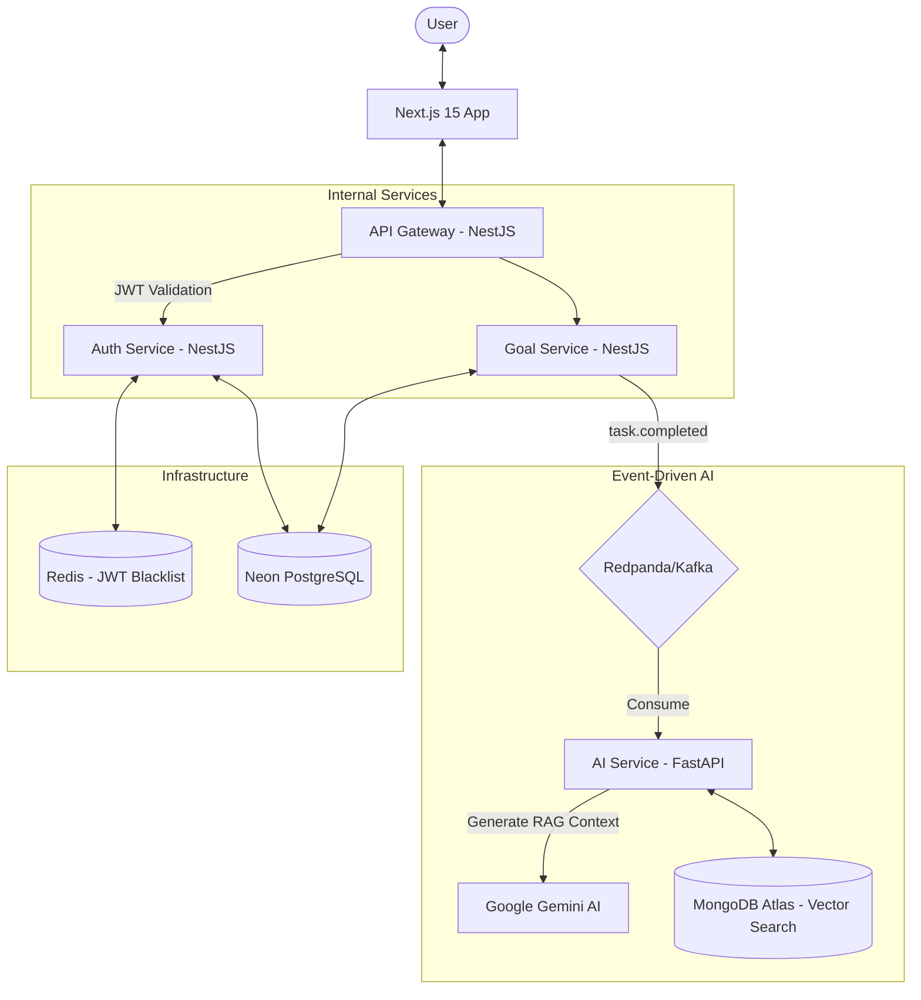

# 🧠 Knowledge Hub OS

An **event-driven, polyglot microservices platform** designed for autonomous productivity tracking and AI-powered coaching. Built as a high-performance, hermetic monorepo powered by **Bazel**.

[](https://bazel.build)
[](https://pnpm.io)
[](https://nextjs.org)
[](https://nestjs.com)
[](https://fastapi.tiangolo.com)
[](https://redpanda.com)

---

## 🚀 Overview

Knowledge Hub OS is a sophisticated productivity ecosystem where users manage goals and tasks while an **AI Brain** operates asynchronously in the background. It generates personalized coaching insights, dynamic career roadmaps, and provides a RAG (Retrieval-Augmented Generation) chatbot that knows your work history.

### Key Pillars
- **Zero-Latency UX**: High-priority task operations are instant; heavy AI processing happens out-of-band via Kafka.
- **Polyglot Architecture**: Leveraging the best tools for each job—NestJS for robust APIs, FastAPI for AI/LLM integration, and Next.js for a premium frontend.
- **Hermetic Builds**: Entire workspace is managed by Bazel, ensuring reproducible builds and lightning-fast incremental testing.

---

## 🏗️ Architecture



---

## 🛠️ Technology Stack

| Layer | Technology | Role |
|---|---|---|
| **Build System** | **Bazel 7 (Bzlmod)** | Hermetic builds, caching, and multi-language support. |
| **Frontend** | **Next.js 15** | App Router, Server Components, Tailwind CSS. |
| **API Gateway** | **NestJS** | Central entry point, **JWT Validation**, and Routing. |
| **Auth Service** | **NestJS + Redis** | Identity management and stateful JWT revocation. |
| **Goal Service** | **NestJS + Prisma** | Core business logic for goals and task tracking. |
| **AI Service** | **FastAPI + LangChain** | LLM orchestration, RAG pipelines, and background workers. |
| **Messaging** | **Redpanda** | Kafka-compatible, low-latency event streaming. |
| **Databases** | **Neon (Postgres) & MongoDB** | Relational data + Vector/Document storage. |

---

## 📂 Repository Structure

```text
knowledge-hub-os/
├── apps/
│   ├── api-gateway/       # NestJS: Entry point, Auth Guard, & Request Routing
│   ├── auth-service/      # NestJS: Identity, Token issuance, & Revocation
│   ├── goal-service/      # NestJS: Product logic (Goals/Tasks)
│   ├── ai-service/        # FastAPI: LLM logic & Kafka consumers
│   └── frontend/          # Next.js: Modern React interface
├── libs/
│   ├── database/          # Shared Prisma schema & client
│   ├── common/            # Shared utilities (CORS, Logging)
│   ├── security/          # Shared JWT & Redis logic
│   ├── kafka/             # Shared messaging abstractions
│   ├── event_schemas/     # Cross-language Type/Pydantic contracts
│   └── exceptions/        # Standardized error handling
├── BUILD.bazel            # Root build configuration
├── MODULE.bazel           # Bzlmod dependency graph
├── docker-compose.yml     # Local orchestration for dev/infra
└── tsconfig.json          # Global TypeScript configuration
```

---

## 🚦 Getting Started

### Prerequisites
- **Node.js 20+** & **pnpm 8+**
- **Python 3.11+**
- **Bazelisk** (`npm install -g @bazel/bazelisk`)
- **Docker + Docker Compose**

### 1. Environment Setup
Clone the repository and prepare your environment:
```bash
git clone https://github.com/your-username/knowledge-hub-os.git
cd knowledge-hub-os
pnpm install
cp .env.example .env # Ensure you fill in your API keys
```

### 2. Infrastructure
Launch the supporting infrastructure (Kafka and Redis):
```bash
docker compose up -d redpanda redis
```

### 3. Build & Run with Bazel
Bazel manages all services hermetically. You can run individual services directly:

```bash
# Identity & Security
bazel run //apps/auth-service:auth-service

# Entry Point & JWT Validation
bazel run //apps/api-gateway:api-gateway

# Core Logic
bazel run //apps/goal-service:goal-service

# AI Brain
bazel run //apps/ai-service:ai-service
```

Alternatively, for the **Frontend**:
```bash
cd apps/frontend
pnpm dev
```

---

## 🏗️ Production Builds & Containerization

Bazel allows for extremely efficient production builds. You can build the entire workspace or individual container images.

```bash
# Build the entire workspace
bazel build //...

# Run all tests hermetically
bazel test //...

# Generate Docker Tarballs (OCI Images)
bazel build //apps/api-gateway:tarball
bazel build //apps/auth-service:tarball
bazel build //apps/goal-service:tarball
bazel build //apps/ai-service:tarball
```

Images are built using **Distroless** bases for a minimal security attack surface.

---

## 🧠 The AI Lifecycle

Knowledge Hub OS implements a "passive-observer" AI pattern:
1. **Event**: A user marks a task as "Complete".
2. **Stream**: The `goal-service` publishes a `task.completed` event to Redpanda.
3. **Analyze**: The `ai-service` consumes the event, triggers a **Gemini 1.5** chain to analyze the task context, and generates a career insight.
4. **Embed**: The insight is converted into a vector embedding and stored in **MongoDB Atlas**.
5. **RAG**: When the user chats with the "Coach", the system performs a vector search over past insights to provide context-aware advice.

---

## ✅ Roadmap & Status

- [x] **Monorepo Foundation**: Bazel 7 + Bzlmod + pnpm workspaces.
- [x] **Event Backbone**: Redpanda/Kafka integration for async AI workflows.
- [x] **Polyglot Persistence**: Seamless Postgres (Prisma) and MongoDB (Vector Search) co-existence.
- [x] **Security**: JWT-based auth with Redis blacklist for stateful logout.
- [x] **AI Engine**: LangChain integration with Google Gemini.
- [x] **Hermetic Builds**: Full Docker containerization via `rules_oci`.
- [ ] **Observability**: Integration with OpenTelemetry & Prometheus (Next Step).
- [ ] **Unit/E2E Testing**: Comprehensive Bazel test suites.

---

**Author:** Muhammed Nazal K  
**License:** MIT
