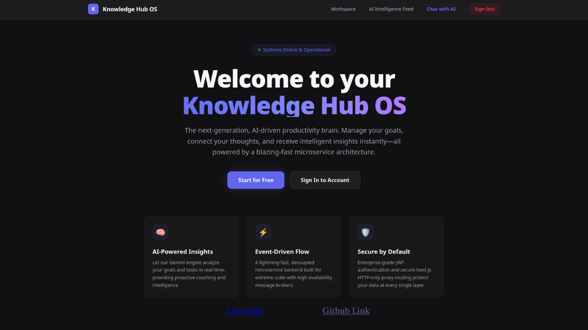

# 🧠 Knowledge Hub OS

<p align="center">
  
</p>

<p align="center">
  Event-driven productivity operating system powered by AI, Kafka, and hermetic Bazel builds.
</p>

<p align="center">
  Polyglot Microservices • AI Coaching • RAG Pipelines • Event Streaming • Hermetic Infrastructure
</p>

<p align="center">
  
  
  
  
  
  
</p>

---

## Overview

Knowledge Hub OS is an event-driven productivity platform where users manage goals, tasks, and long-term growth while an asynchronous AI engine continuously analyzes activity in the background.

The platform combines:

* real-time event streaming
* polyglot microservices
* RAG-powered AI coaching
* hermetic Bazel builds
* vector search pipelines

to create an intelligent productivity operating system optimized for scalability and low-latency user experiences.

Heavy AI workloads are decoupled from user-facing operations through Kafka-based asynchronous workflows, ensuring responsive interactions while background intelligence continuously evolves.

---

## Features

* Event-driven productivity workflows
* AI-generated coaching insights
* Dynamic career roadmap generation
* RAG-powered contextual chatbot
* Kafka/Redpanda asynchronous processing
* Hermetic Bazel-based monorepo
* JWT authentication with Redis revocation
* Vector search with MongoDB Atlas
* Polyglot microservice architecture
* Distroless OCI container builds
* Shared cross-language contracts

---

## Tech Stack

| Layer            | Technologies                     |
| ---------------- | -------------------------------- |
| Frontend         | Next.js 15, React, Tailwind CSS  |
| Backend          | NestJS, FastAPI                  |
| AI Layer         | LangChain, Gemini 1.5            |
| Messaging        | Redpanda (Kafka API)             |
| Databases        | PostgreSQL, MongoDB Atlas, Redis |
| Build System     | Bazel 7, Bzlmod                  |
| Tooling          | pnpm, Prisma                     |
| Containerization | rules_oci, Distroless Images     |

---

## System Flow

```text
User Interaction
        │
        ▼
Next.js Frontend
        │
        ▼
API Gateway (NestJS)
        │
 ┌──────┴────────┐
 ▼               ▼
Auth Service   Goal Service
 │               │
 ▼               ▼
Redis         PostgreSQL
                │
                ▼
      task.completed Event
                │
                ▼
       Redpanda / Kafka
                │
                ▼
       AI Service (FastAPI)
                │
        ┌───────┴────────┐
        ▼                ▼
 Gemini AI         MongoDB Atlas
 (Analysis)        (Vector Search)
                │
                ▼
         AI Coaching Layer
```

---

## Architecture Highlights

### Event-Driven AI

AI processing is completely decoupled from the request lifecycle.

Task completion events are published asynchronously to Redpanda, allowing AI pipelines to analyze behavior without blocking the user experience.

### Polyglot Services

Each service uses the most suitable runtime:

* NestJS for transactional APIs
* FastAPI for AI orchestration
* Next.js for frontend rendering

### Hermetic Bazel Builds

The entire workspace is managed by Bazel using Bzlmod dependency graphs, enabling:

* reproducible builds
* remote caching
* fast incremental compilation
* multi-language orchestration

### Retrieval-Augmented Generation (RAG)

The AI layer stores generated coaching insights as embeddings inside MongoDB Atlas vector collections, enabling context-aware conversations and personalized recommendations.

### Shared Contracts

Cross-language event contracts are centralized through shared schema libraries to ensure consistency between TypeScript and Python services.

---

## Repository Structure

```bash
knowledge-hub-os/
├── apps/
│   ├── api-gateway/
│   ├── auth-service/
│   ├── goal-service/
│   ├── ai-service/
│   └── frontend/
├── libs/
│   ├── database/
│   ├── common/
│   ├── security/
│   ├── kafka/
│   ├── event_schemas/
│   └── exceptions/
├── BUILD.bazel
├── MODULE.bazel
├── docker-compose.yml
└── tsconfig.json
```

---

## Getting Started

### Prerequisites

* Node.js 20+
* pnpm 8+
* Python 3.11+
* Docker & Docker Compose
* Bazelisk

---

## Installation

```bash
git clone https://github.com/your-username/knowledge-hub-os.git

cd knowledge-hub-os

pnpm install
```

---

## Environment Setup

```bash
cp .env.example .env
```

Configure:

* Gemini API keys
* database credentials
* Redis connection
* Kafka brokers

---

## Infrastructure

Start Redpanda and Redis locally:

```bash
docker compose up -d redpanda redis
```

---

## Run Services

### Authentication Service

```bash
bazel run //apps/auth-service:auth-service
```

### API Gateway

```bash
bazel run //apps/api-gateway:api-gateway
```

### Goal Service

```bash
bazel run //apps/goal-service:goal-service
```

### AI Service

```bash
bazel run //apps/ai-service:ai-service
```

### Frontend

```bash
cd apps/frontend

pnpm dev
```

---

## Production Builds

### Build Entire Workspace

```bash
bazel build //...
```

### Run Tests

```bash
bazel test //...
```

### Build OCI Images

```bash
bazel build //apps/api-gateway:tarball
bazel build //apps/auth-service:tarball
bazel build //apps/goal-service:tarball
bazel build //apps/ai-service:tarball
```

Container images are generated using distroless bases for reduced attack surface and smaller runtime footprints.

---

## AI Lifecycle

### 1. User Activity

A user completes a task inside the productivity workspace.

### 2. Event Streaming

The `goal-service` publishes a `task.completed` event to Redpanda.

### 3. AI Analysis

The `ai-service` consumes the event and triggers LangChain workflows powered by Gemini.

### 4. Embedding Pipeline

Generated coaching insights are converted into vector embeddings and stored in MongoDB Atlas.

### 5. Contextual Coaching

The RAG chatbot performs vector similarity search over historical insights to deliver personalized coaching responses.

---

## Performance & Engineering

| Capability    | Details                                         |
| ------------- | ----------------------------------------------- |
| Build System  | Hermetic Bazel builds with reproducible outputs |
| Messaging     | Kafka-compatible Redpanda event streaming       |
| AI Processing | Fully asynchronous background execution         |
| Security      | JWT auth with Redis-backed token revocation     |
| Containers    | Distroless OCI image generation                 |
| Scalability   | Independent service deployment & scaling        |

---

## Current Status

| Feature                 | Status     |
| ----------------------- | ---------- |
| Bazel Monorepo          | ✅ Complete |
| Redpanda Event Backbone | ✅ Complete |
| JWT Authentication      | ✅ Complete |
| RAG AI Pipeline         | ✅ Complete |
| OCI Containerization    | ✅ Complete |
| OpenTelemetry           | 🚧 Planned |
| Prometheus Metrics      | 🚧 Planned |
| E2E Testing             | 🚧 Planned |

---

## Roadmap

### Phase 1

* OpenTelemetry tracing
* Prometheus metrics
* Grafana dashboards

### Phase 2

* AI memory optimization
* Multi-model LLM orchestration
* Streaming AI responses

### Phase 3

* Kubernetes deployment support
* Distributed Bazel remote caching
* Multi-region infrastructure

### Phase 4

* Multi-tenant workspaces
* AI-generated productivity scoring
* Autonomous scheduling assistant

---

## Development

### Build

```bash
bazel build //...
```

### Test

```bash
bazel test //...
```

### Frontend Development

```bash
cd apps/frontend

pnpm dev
```

---

## Documentation

```text
docs/
├── architecture.md
├── ai-pipeline.md
├── deployment.md
├── bazel-workflows.md
└── contributing.md
```

---

## License

MIT License

---

## Author

Muhammed Nazal K
